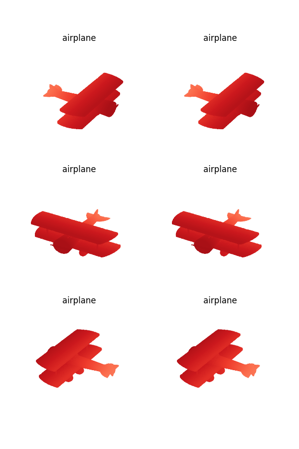
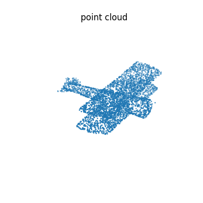

# PCVT - Point Cloud Visualization Tools

This project is established for visualizing point cloud data.

## pcvt1

pcvt1 create an image by matplotlib and visualize it with opencv. Also, you can save the image to file.

## pcvt2

pcvt2 visualize point cloud with graphics library [Open3D](http://www.open3d.org/). It will create a window that you can rotate, scale and translate the point cloud with your mouse.

## pcvt3

pcvt3 visualize point cloud with matplotlib. The function `plot_pcd_one_view` can only visualize many point cloud in a fixed angle.

The function `plot_pcd_three_views` will visualize every point cloud in three different views rotated along up axis. You also can add title for every point cloud.

You can reset the view angle and color by yourself.

## pcvt4

pcvt4 is cannot visualize the point cloud directly. It will create ball in every point of the point cloud and generate a mesh (`pc_mesh.ply`). In order to visualize the mesh, you can use the 3D modeling software such as [blender](https://www.blender.org/). For a sparse point cloud, you'd better set a larger radius.

Here are two examples visualized by blender:

## pcvt5

Similar to pcvt3.

## pcvt6

pcvt6 use blender script to render point cloud. You can adjust the color of the point cloud and the radius of the point. Maybe you also need to rotate the point cloud by rotation matrix. In order to render the point cloud, please run `render_pc.sh`. Here are visualizing results:

